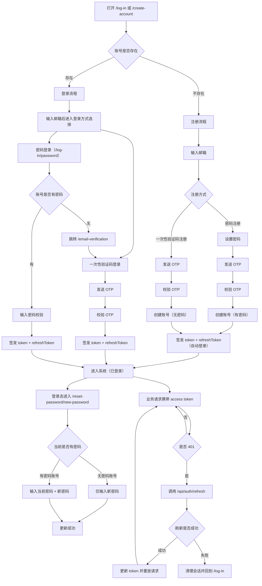

# OneBook AI 账号流程文档（登录/注册/验证码/密码）

本文档定义本项目账号相关流程，作为前后端联调与实现依据。

## 1. 范围
- 注册（密码注册、一次性验证码注册）
- 登录（密码登录、一次性验证码登录）
- 登录态修改密码
- 刷新会话与退出登录

## 2. 核心规则
- 注册支持两种模式：
  - 密码注册：先设置密码，再验证码校验。
  - 一次性验证码注册：无密码创建账号。
- 注册成功后直接签发 `token + refreshToken`，用户处于已登录状态。
- 已存在账号登录时，始终支持“密码登录”与“一次性验证码登录”二选一。
- 若账号无密码，访问 `/log-in/password` 时应跳转到 `/email-verification`（或返回错误码后前端跳转）。
- 登录态允许进入 `/reset-password/new-password` 设置/修改密码。

## 3. 页面映射
- 入口页：`/log-in`、`/create-account`
- 密码页：`/log-in/password`、`/create-account/password`
- 验证码页：`/email-verification`（兼容 `/log-in/verify`）
- 重置密码页：`/reset-password/new-password`
- 错误页：`/log-in/error`

## 4. 总流程图

## 5. 接口契约建议（对外走 Gateway）
- `POST /api/auth/signup`：密码注册
- `POST /api/auth/login`：密码登录
- `POST /api/auth/refresh`：刷新 access token
- `POST /api/auth/logout`：退出登录
- `POST /api/auth/otp/send`：发送一次性验证码
- `POST /api/auth/otp/verify`：校验一次性验证码并换取登录态或注册凭据
- `POST /api/users/me/password`：登录态修改密码

### 5.1 OTP 关键字段
- `otp/send` 请求体：
  - `email`
  - `purpose`：`signup_password | signup_otp | login_otp`
- `otp/verify` 请求体：
  - `challengeId`
  - `email`
  - `purpose`
  - `code`
  - `password`（仅 `signup_password` 必填）

### 5.2 关键错误码约定
- `AUTH_PASSWORD_NOT_SET`：密码登录入口命中无密码账号，前端跳转到 `/email-verification`
- `AUTH_OTP_CHALLENGE_INVALID`：challenge 无效
- `AUTH_OTP_CODE_INVALID`：验证码错误
- `AUTH_OTP_CODE_EXPIRED`：验证码过期
- `AUTH_OTP_SEND_RATE_LIMITED`：OTP 发送限流
- `AUTH_OTP_VERIFY_RATE_LIMITED`：OTP 校验限流

## 6. 安全与风控要求
- OTP 单次使用，建议 5 分钟有效期，成功后立即失效。
- OTP 发送与校验均需限流（email + IP 维度）。
- 统一错误结构：`error + code + requestId + details`。
- 全链路透传并回传 `X-Request-Id`，日志保留 `request_id` 字段。

## 7. 待实现（邮件通道）
- 当前状态：
  - OTP 发送链路已实现 challenge 生成与校验，但未接入真实邮件服务。
  - 当前仅在服务日志输出 OTP（开发态）。
- 目标方案（后续实现）：
  - 毕设/个人项目阶段：首选 `Resend`，优先保证接入速度与演示稳定性。
  - 产品化阶段：升级为可切换多通道，建议 `SES` 作为主通道（成本优先），保留 `Resend`/`Postmark` 作为故障切换。
  - 统一抽象 `EmailSender` 接口，配置化切换 provider（`mock|resend|ses|postmark`）。
- 实现验收标准：
  - `POST /api/auth/otp/send` 在成功时实际发送邮件，不再输出明文 OTP 到日志。
  - 生产环境启用域名认证（`SPF`/`DKIM`/`DMARC`）。
  - 失败可观测：记录 provider 响应码、requestId、重试与限流结果。
  - 事务邮件与营销邮件分离（独立子域/独立通道），避免互相影响送达率。
